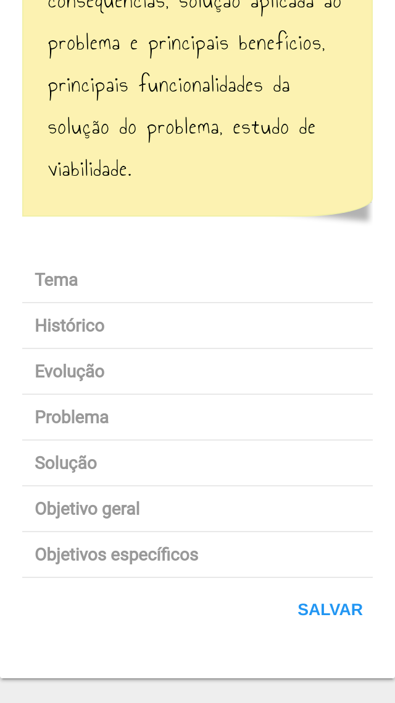

# Fast TCC

FastTCC 2017 - Curso Técnico em Informática

Aplicação que auxila alunos a escreverem uma documentação de TCC. A aplicação disponibiliza dicas pedagógicas e exemplos afim de que o aluno familiarize com os tópicos abordados em uma documentação.
Ao final, é possível gerar todo o documento padronizado de acordo com as Normas ABNT requerida em documentações do Instituto Centro Paula Souza.

## Integrantes:
- Eduardo Nunes Cordeiro dos Santos
- Gabriela Harumi Gomes
- Jason Davin Oliveira Carneiro
- José Carlos Sousa da Silva


## Executando

```
source dev.sh # importa comandos bash
dkupd # inicia os containers docker
db_setup # cria estrutura do banco de dados
```

Aplicação escutando -> http://localhost





